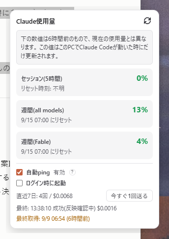
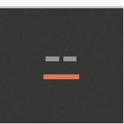

# UsageTray

Claudeのセッション(5時間)・週間の使用量制限をトレイ/メニューバーに常時表示するデスクトップアプリ。加えて、使用量の枠が切れた時だけ最小コストのpingを自動送信し、使い方次第でリセット時刻が後ろへずれていくのを防ぎます。

## スクリーンショット



セッション/週間(all models)/週間(Fable)の使用率とリセット時刻、自動ping・ログイン時起動のトグル、直近7日の送信実績を1つのポップアップで表示します。



トレイアイコン。上のスクリーンショットは実際にこのPCで撮影したもので、ローカルの使用量キャッシュ(`~/.claude.json`)が6時間以上更新されていなかったため「--」(データが古い)と表示されています。この値はこのPCでClaude Codeが動いた時にだけ更新されるので、数値を偽って出すより「古い」と分かる表示にしています。

## できること

- **常時表示**: トレイアイコンにセッション使用率を2桁で表示(Windows)。macOSはメニューバーにアイコン+数字。使用率に応じて色が変化(緑→橙→赤)
- **詳細ポップアップ**: クリックでセッション/週間(全モデル)/週間(Fable)の使用率とリセット時刻を表示
- **自動ping(既定OFF)**: 使用量の枠が切れたら、Haikuに最小の1往復(実測 約$0.001〜0.002)を自動送信して新しい枠を開始。放置による「次に使った時点から枠が始まる」ズレを防ぎます
- **手動ping**: 動作確認用に、判定を待たず1回だけ即時送信するボタン
- **ログイン時に起動**: OSのスタートアップに登録するチェックボックス
- **メモリ節約**: 待機時はトレイアイコンのみでウィンドウを一切生成しません。ポップアップは開閉のたびに生成・破棄します

## インストール

[Releases](https://github.com/terasaki-8910/claude-usage-tray/releases/latest) から:

- **Windows**: `UsageTray-Setup-x.y.z.exe`
- **macOS (Apple Silicon)**: `UsageTray-x.y.z-arm64.dmg`
- **macOS (Intel)**: `UsageTray-x.y.z-x64.dmg`

### macOSの初回起動について

未署名のビルドです(Apple Developer Programの署名なし)。初回はGatekeeperに阻まれるため、アプリを**右クリック→「開く」**を選ぶか、ターミナルで:

```sh
xattr -dr com.apple.quarantine "/Applications/UsageTray.app"
```

## しくみ

Claude Codeの使用量制限には公開JSONやAPIがありません。このアプリはClaude Code CLI自身がローカルに書き出すキャッシュファイル(`~/.claude.json` の `cachedUsageUtilization`)を直接読むだけで、プロセス起動やスクレイピングは行いません。

自動pingは `claude --print --safe-mode ...` を、コストを最小化する設定(デフォルトのシステムプロンプト無効化・ツール無効化・低effort・予算上限つき)で子プロセスとして実行します。`--safe-mode` を外すと、設定済みのMCPサーバーのツール定義が読み込まれてコストが100倍以上に跳ね上がることを実測で確認しています。詳細は [`src/core/ping-args.ts`](src/core/ping-args.ts) を参照してください。

## 開発

```sh
npm install
npm run dev         # 開発モード
npm test            # ユニットテスト
npm run build:win   # Windowsインストーラーをビルド
```
